# markdown 中使用 mermaid

参考
>https://mermaidjs.github.io

用法

就是使用“ mermaid”代码块
```
...mermaid
```

# 流程图

流程图方向

- TB 从上到下
- BT 从下到上
- RL 从右到左
- LR 从左到右
- TD 同TB

```
graph RL
   A --> B
```
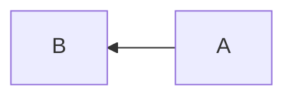

基本图形

- id + [文字描述]矩形
- id + (文字描述)圆角矩形
- id + >文字描述]不对称的矩形
- id + {文字描述}菱形
- id + ((文字描述))圆形

```
graph TD
    id1[矩形]
    id2(圆角矩形)
    id3>不对称的矩形]
    id4{菱形}
    id5((圆形))
```
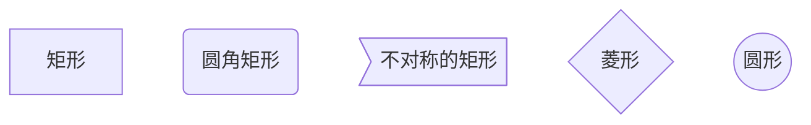

节点之间的连接

- A --> B : A带箭头指向B
- A --- B : A不带箭头指向B
- A -.- B : A用虚线指向B
- A -.-> B : A用带箭头的虚线指向B
- A ==> B : A用加粗的箭头指向B
- A -- 描述 --- B : A不带箭头指向B并在中间加上文字描述
- A -- 描述 --> B : A带箭头指向B并在中间加上文字描述
- A -. 描述 .-> B : A用带箭头的虚线指向B并在中间加上文字描述
- A == 描述 ==> B : A用加粗的箭头指向B并在中间加上文字描述

```
graph TD
    A1 --> B1
    A2 --- B2
    A3 -.- B3
    A4 -.-> B4
    A5 ==> B5
    A6 -- 描述 --- B6
    A7 -- 描述 --> B7
    A8 -. 描述 .-> B8
    A9 == 描述 ==> B9
```
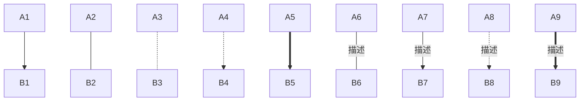


子流程图

```
subgraph title
    graph definition
end
```
```
graph TB
    c1-->a2
    subgraph one
    a1-->a2
    end
    subgraph two
    b1-->b2
    end
    subgraph three
    c1-->c2
    end
```
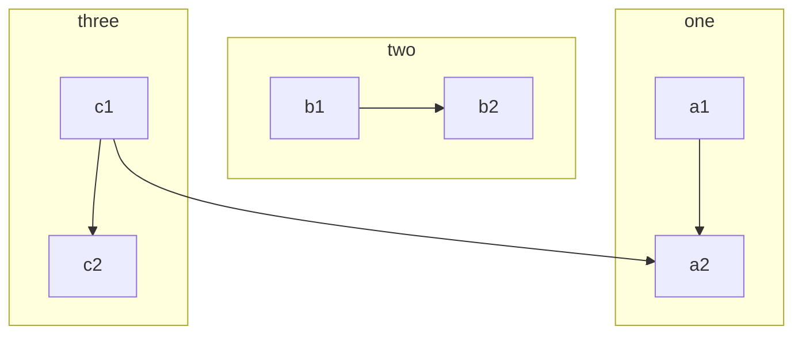

# 时序图 sequence diagram

## 标准时序图

基本语法：

||说明|
|:-|:-|
|Title:标题 |指定时序图的标题|
|Note direction of 对象:描述 |在对象的某一侧添加描述。<br>direction 可以为 right/left/over；<br>对象 可以是多个对象，以“逗号”（,）作为分隔符|
|participant 对象 |创建一个对象|
|loop...end |创建一个循环体|
|对象A->对象B:描述 |绘制A与B之间的对话，以实线连接<br>-> 实线实心箭头指向<br>--> 虚线实心箭头指向<br>->> 实线小箭头指向<br>-->> 虚线小箭头指向|

```
...sequence
Title:时序图示例
客户端->服务端: 我想找你拿下数据 SYN
服务端-->客户端: 我收到你的请求啦 ACK+SYN
客户端->>服务端: 我收到你的确认啦，我们开始通信吧 ACK
Note right of 服务端: 我是一个服务端
Note left of 客户端: 我是一个客户端
Note over 服务端,客户端: TCP 三次握手
participant 观察者
```

```sequence
Title:时序图示例
客户端->服务端: 我想找你拿下数据 SYN
服务端-->客户端: 我收到你的请求啦 ACK+SYN
客户端->>服务端: 我收到你的确认啦，我们开始通信吧 ACK
Note right of 服务端: 我是一个服务端
Note left of 客户端: 我是一个客户端
Note over 服务端,客户端: TCP 三次握手
participant 观察者
```

## 带样式时序图

基本语法同标准时序图，不同的是
- 需要使用 mermaid 解析，并在开头使用关键字 sequenceDiagram 指明
- 线段的样式遵循 mermaid 的解析方式  
  -> ： 实线连接  
  --> ：虚线连接  
  ->> ：实线箭头指向  
  -->> ：虚线箭头指向

```
sequenceDiagram
    Alice->John : Hello John, how are you ?
    John-->Alice:Great!
    Alice->>John: dont borther me !
    John-->>Alice:Great!
    Alice-xJohn: wait!
    John--xAlice: Ok!
```
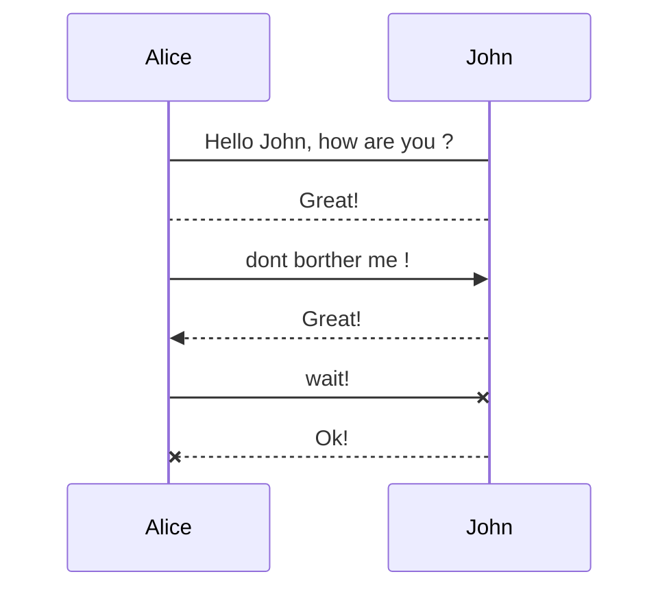

```
sequenceDiagram
　　Alice->>John: Hello John, how are you ?
　　John-->>Alice: Great!
　　Alice->>John: Hung,you are better .
　　John-->>Alice: yeah, Just not bad.
```
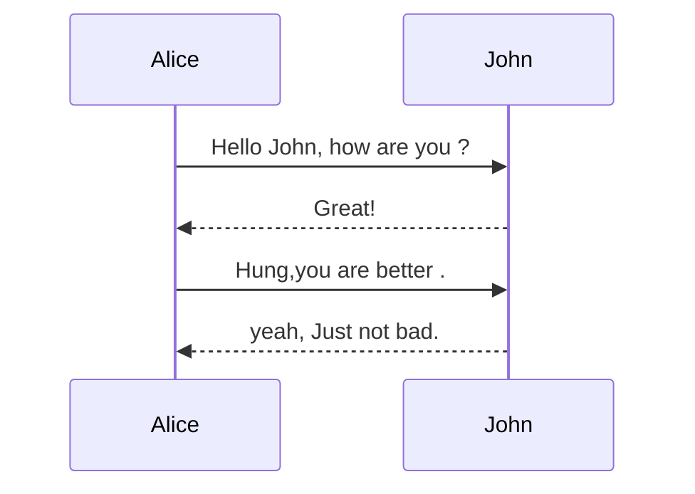

```
sequenceDiagram
    participant A as Alice
    participant J as John
    A->>J: Hello John, how are you?
    J->>A: Great!
```
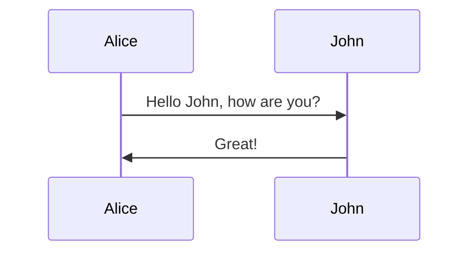

```
sequenceDiagram
    participant Alice
    participant Bob
    Alice->John: Hello John, how are you?
    loop Healthcheck
        John->John: Fight against hypochondria
    end
    Note right of John: Rational thoughts <br/>prevail...
    John-->Alice: Great!
    John->Bob: How about you?
    Bob-->John: Jolly good!
```
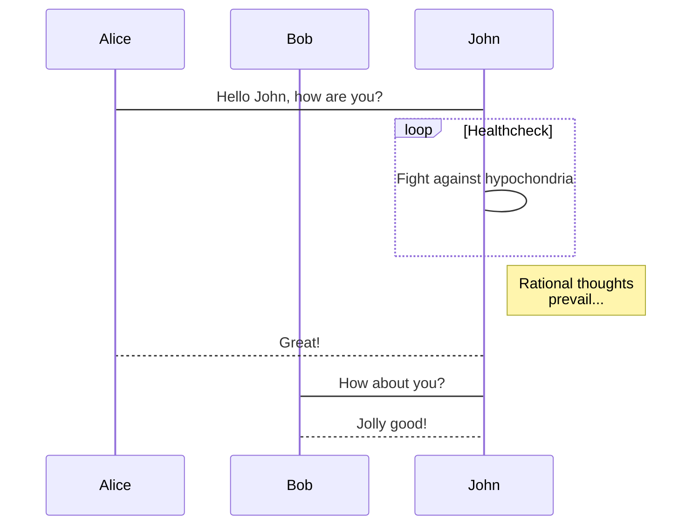

```
sequenceDiagram
  Alice -> John: Hello John, how are you
  Note over Alice,John: A typical interaction
```
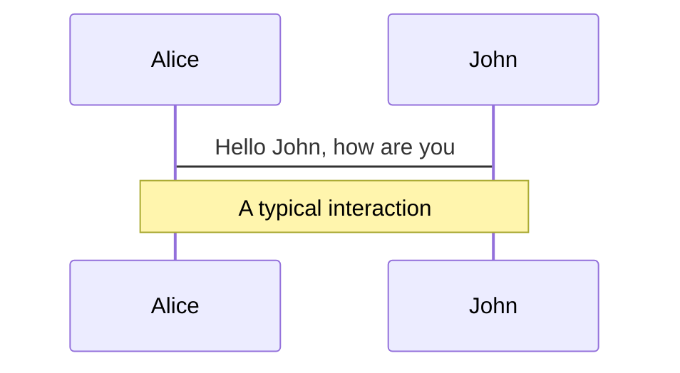

对象激活

在时序图中可以激活和去激活一个参与者，激活/去激活使用各自单独的声明
```
sequenceDiagram
  Alice ->> John: Hello John, how are you?
  activate John
  John -->> Alice: Greate!
  deactivate John
```
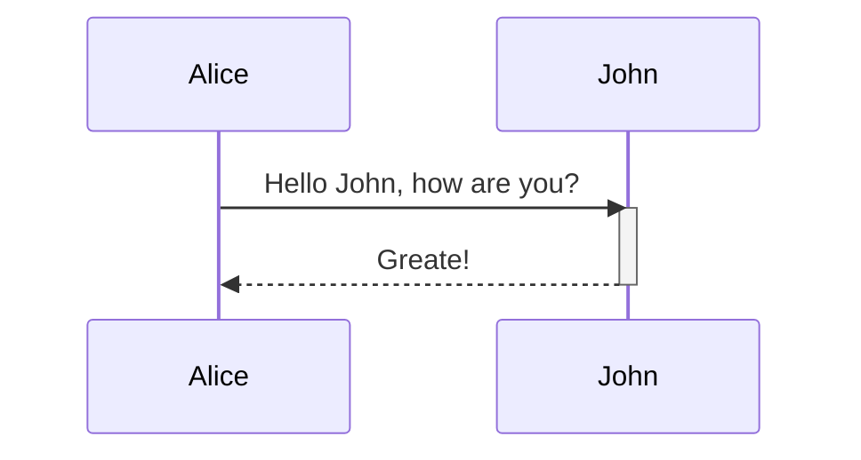

也可以使用在消息箭头后追加+/-的方式来激活去激活对象
```
sequenceDiagram
  Alice ->> +John: Hello John, how are you?
  John --> -Alice: Greate!
```
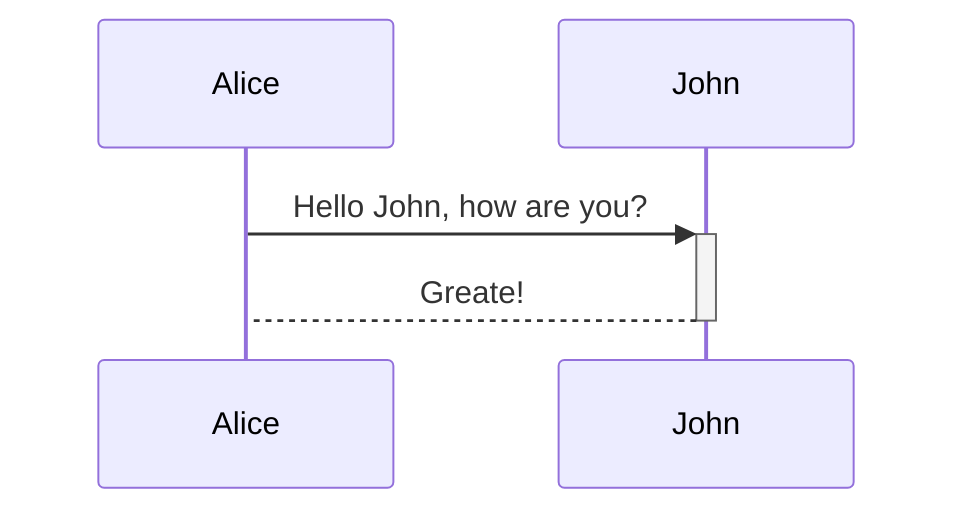

激活去激活在同一个Actor上可以叠加的
```
sequenceDiagram
  Alice ->> +John: Hello John, how are you?
  Alice ->> +John: John, can you hear me?
  John -->> -Alice: Hi Alice, I can hear you!
  John -->> -Alice: I feel greate!
```
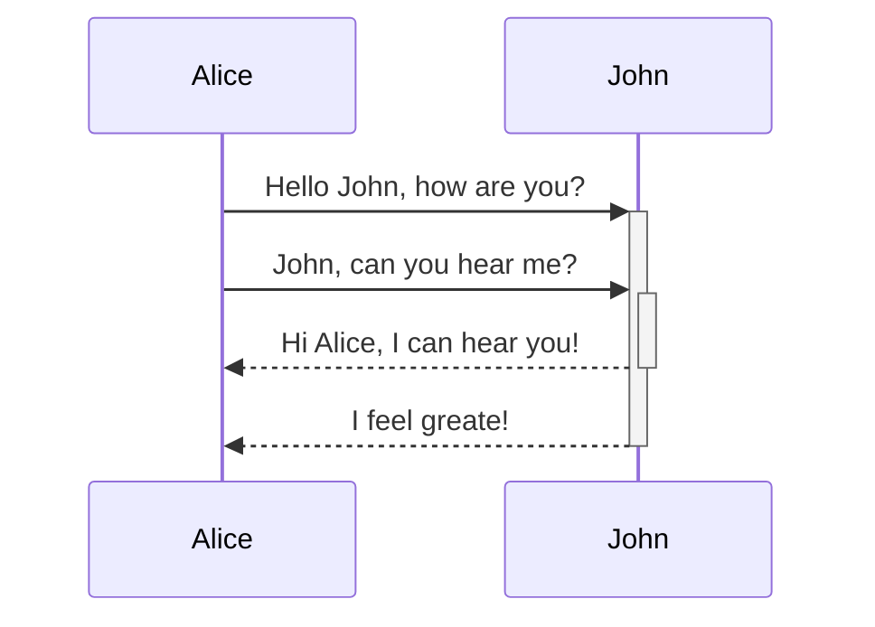

# Class diagrams

>|"In software engineering, a class diagram in the Unified Modeling Language (UML) is a type of static structure diagram that describes the structure of a system by showing the system's classes, their attributes, operations (or methods), and the relationships among objects." Wikipedia

The class diagram is the main building block of object-oriented modeling. It is used for general conceptual modeling of the structure of the application, and for detailed modeling translating the models into programming code. Class diagrams can also be used for data modeling. The classes in a class diagram represent both the main elements, interactions in the application, and the classes to be programmed.

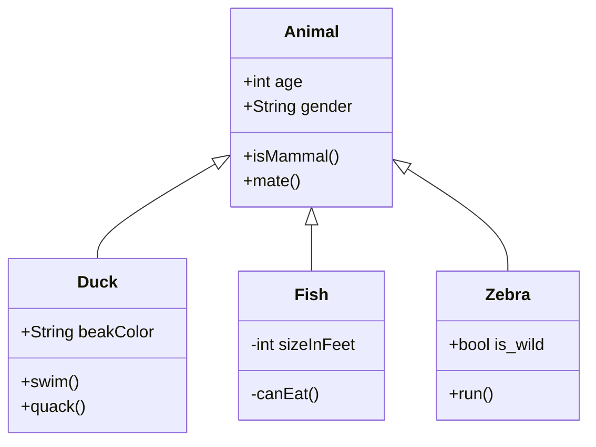

# State diagrams

>|"A state diagram is a type of diagram used in computer science and related fields to describe the behavior of systems. State diagrams require that the system described is composed of a finite number of states; sometimes, this is indeed the case, while at other times this is a reasonable abstraction." Wikipedia

Mermaid can render state diagrams. The syntax tries to be compliant with the syntax used in plantUml as this will make it easier for users to share diagrams between mermaid and plantUml.

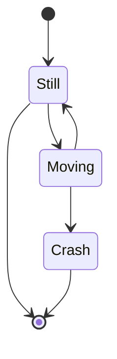

# gantt甘特图

基本语法：
- 使用 mermaid 解析语言，在开头使用关键字 gantt 指明
- deteFormat 格式：指明日期的显示格式
- title 标题：设置图标的标题
- section 描述：定义纵向上的一个环节
- 定义步骤：每个步骤有两种状态 done（已完成）/ active（执行中） 
  - 描述: 状态,id,开始日期,结束日期/持续时间
  - 描述: 状态[,id],after id2,持续时间
  - crit ：可用于标记该步骤需要被修正，将高亮显示
  - 如果不指定具体的开始时间或在某个步骤之后，将默认依次顺序排列

```
gantt
　　　dateFormat　YYYY-MM-DD
　　　title Adding GANTT diagram functionality to mermaid
　　　section A section
　　　Completed task:done, des1, 2014-01-06,2014-01-08
　　　Active task   :active, des2, 2014-01-09, 3d
　　　future task   :        des3, after des2, 5d
　　　future task2  :        des4, after des3, 5d
　　　section Critical tasks
　　　Completed task in the critical line :crit, done, 2014-01-06,24h
　　　Implement parser and json           :crit, done, after des1, 2d
　　　Create tests for parser             :crit, active, 3d
　　　Future task in critical line        :crit, 5d
　　　Create tests for renderer           :2d
　　　Add to ,mermaid                     :1d
```

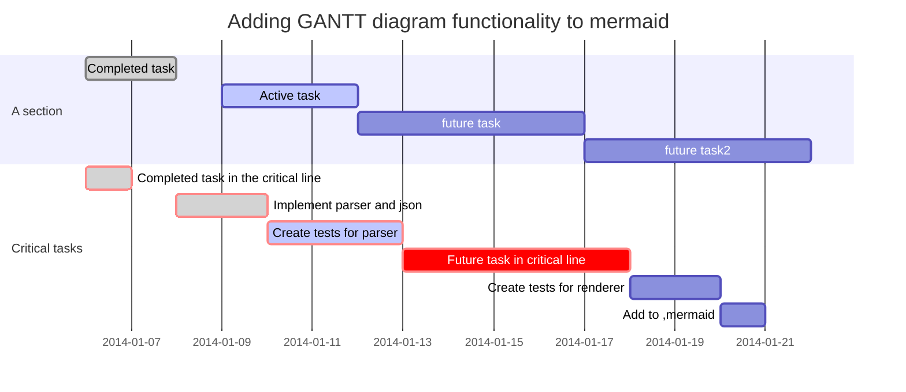

关键字说明：

|关键字|说明|
|:-|:-|
|title|标题|
|dateFormat|日期格式|
|section|模块|
|Completed|已经完成|
|Active|当前正在进行|
|Future|后续待处理|
|crit|关键阶段|

# 饼图

```
pie
    title Key elements in Product X
    "Calcium" : 42.96
    "Potassium" : 50.05
    "Magnesium" : 10.01
    "Iron" :  5
```
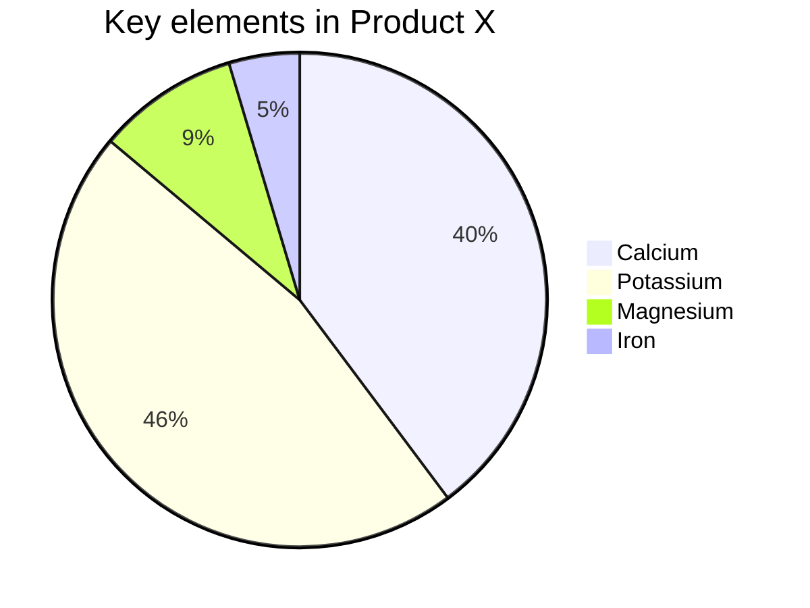


# 流程图

## 标准流程图

节点类型

|节点|说明|
|:-|:-|
|start |流程开始，以圆角矩形绘制|
|opearation |操作，以直角矩形绘制|
|condition |条件判断，以菱形绘制|
|subroutine |子流程，以左右带空白框的矩形绘制|
|parallel |多输出操作（矩形）|
|inputoutput |输入输出，以平行四边形绘制|
|end |流程结束，以圆角矩形绘制|

### 基本语法：

节点定义 
- “描述”的前面必须有空格，“=>” 两端不能有空格

```
id=>关键字: 描述
```


节点间的流向：
- `模块1 id->模块2 id` ：一般的箭头指向
- `条件模块id (描述)->模块id(direction)` ：条件模块跳转到对应的执行模块，并指定对应分支的布局方向

- `变量名1->变量名2->...->变量名n`

连线样式
- 设置变量m和变量n之间连线的样式，具体样式由变量n后面key-value控制，需要两个变量之间有直接连线。语法中的连接符为（@>）。

```
变量名m@>变量名n({"key":"value"})
```

- key、value
  - yes/true：condition类型变量连接时，用于分别表示yes条件的流向
  - no/false：同上，表示否定条件的流向
  - left/right：表示连线出口在节点位置（默认下面是出口，如op3），可以跟condition变量一起用：cond(yes,right)
  - path1/path2/path3：parallel变量的三个出口路径（默认下面是出口）

节点状态
- 为节点设置不同的状态，可以通过不同的颜色显示，其中状态包括下面6个，含义如英文所示，不过CSDN中好像目前还不支持：
  - past
  - current
  - future
  - approved
  - rejected
  - invalid

示例：

```
flowchat
st=>start: 开始
ipt=>inputoutput: 输入一个x
op=>operation: 处理加工x+1
cond=>condition: 溢出（是或否？）
sub=>subroutine: 子流程
io=>inputoutput: 输出x
ed=>end: 结束
```

```
flowchat
st=>start: 开始
ipt=>inputoutput: 输入一个x
op=>operation: 处理加工x+1
cond=>condition: 溢出（是或否？）
sub=>subroutine: 子流程
io=>inputoutput: 输出x
ed=>end: 结束
```


# UML流程图

```
...flow
st=>start: Start|past:>http://www.google.com[blank]
e=>end: End:>http://www.google.com
op1=>operation: My Operation|past
op2=>operation: Stuff|current
sub1=>subroutine: My Subroutine|invalid
cond=>condition: Yes or No?|approved:>http://www.baidu.com
c2=>condition: Good idea|rejected
io=>inputoutput: catch something...|request

st->op1(right)->cond
cond(yes, right)->c2
cond(no)->sub1(left)->op1
c2(yes)->io->e
c2(no)->op2->e
```
```flow
st=>start: Start|past:>http://www.google.com[blank]
e=>end: End:>http://www.google.com
op1=>operation: My Operation|past
op2=>operation: Stuff|current
sub1=>subroutine: My Subroutine|invalid
cond=>condition: Yes or No?|approved:>http://www.baidu.com
c2=>condition: Good idea|rejected
io=>inputoutput: catch something...|request

st->op1(right)->cond
cond(yes, right)->c2
cond(no)->sub1(left)->op1
c2(yes)->io->e
c2(no)->op2->e
```

未完待续... ...