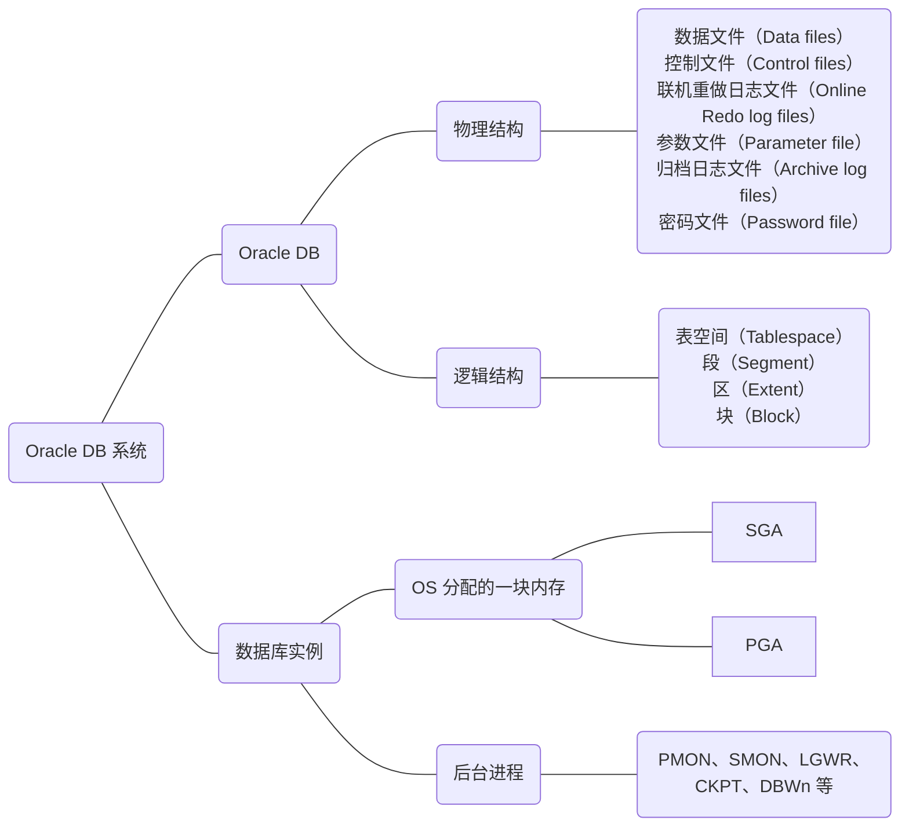
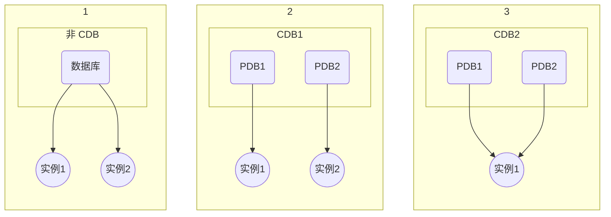
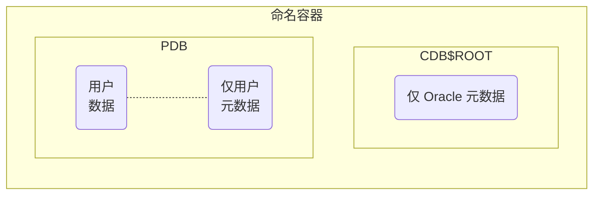
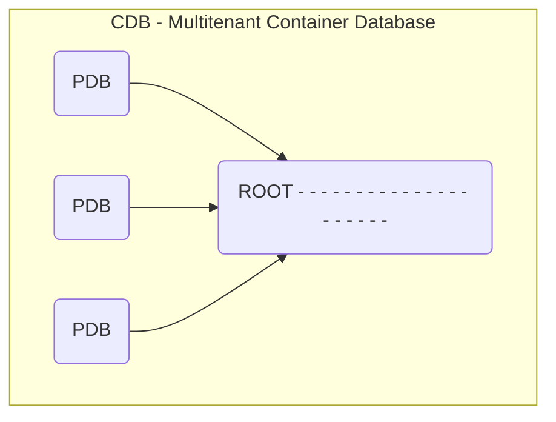
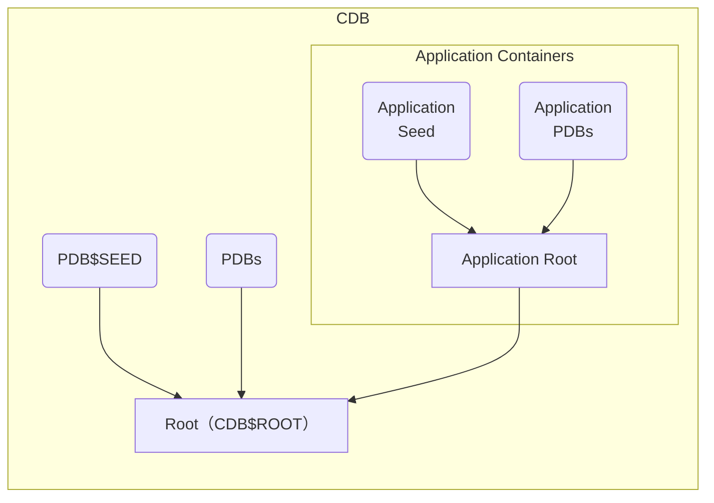

# 多租户容器数据库和可插拔数据

数据库合并：Oracle 多租户是 Oracle Database 12c 中的新选项。使用多租户体系结构，Oracle DB 可以包含一组可移植的方案、对象和相关结构，面向应用程序作为一个逻辑上的单独数据库出现。

**问题**

许多 Oracle 客户都有大量构建于 Oracle RDBMS 上的“部门”应用程序
- 硬件使用率不高
- 应为实例和存储空间开销，无法在同一物理和存储服务器上放置大量“部门”数据库
- 往往不复杂，不需要全职 dba
- 打补丁或升级

**非 CDB（non-CDB）**

旧的体系结构称为**非 CDB 体系结构**。术语“非 CDB”将用作12.1之前版本的数据库的一种简称，这里数据库使用12.1之前版本的体系结构。
- 实例
  - 后台进程
  - SGA 内存
- 数据字典：存储 Oracle 元数据

**新的多租户体系结构优点**
1. 以更低成本在集中管理的平台中操作多个数据库
   - 实例开销较低
   - 存储成本较低
1. 降低 DBA 资源成本并维护安全性
   - 无应用程序更改
   - 快速且易于预配
     - 节约打补丁和升级的时间
     - 讲一下各项的职责分离开来
       - 不同的应用程序管理员
       - 应用程序管理员和 DBA
       - 应用程序中的用户
1. 提供隔离  
   确保与非 CDB 的完全向后兼容性
1. 使用 RAC 和 Data Guard 进行完全操作
1. 受到 Enterprise Manager 支持
1. 与资源管理器集成
1. 允许对多个数据库进行集中管理
   - 备份或灾难恢复
   - 大病和升级

## 数据库和实例



数据库（DATABASE）是一个数据集合，Oracle 数据库都将其数据存放在数据文件中。在物理结构上，Oracle 数据库必须的3类文件分别是数据文件、控制文件和联机重做日志文件。在逻辑结构上，Oracle 数据库由表空间、段、区和块组成。数据库名称由 DB_NAME 来标识。

实例（INSTANCE）是操作 Oracle 数据库的一种手段。它是由 OS 分配的一块内存（包括 SGA 和 PGA）和一些后台进程（PMON、SMON、LGWR、CKPT、DBWn 等）组成的。实例在启动时会对去初始化参数文件（SPFILE 和 PFILE），获取数据库运行时的参数的值。实例名称由 INSTANCE_NAME 来标识。



### 数据库

数据库名
```sql
SQL> show parameters db_name
```

ASM
```
# su - grid
$ asmcmd
ASMCMD> cd +DATA/OCP19CDB/
ASMCMD> ls
```

数据文件
```sql
SQL> SELECT name FROM v$datafile;
```

重做日志文件
```sql
SQL> SELECT * FROM v$log;
```

参数文件
```sql
SQL> show parameters spfile
```

临时文件
```sql
SQL> SELECT * FROM v$tempfile;
```

表空间
```sql
SQL> SELECT * FROM v$tablespace;
```

### 实例

实例名
```sql
SQL> show parameters instance_name
```

内存
```sql
SQL> show parameters target
```

进程
```
# ps -ef | grep ora_
```

## 多租户容器数据库体系结构



Oracle 提供的对象位于成为**根容器**（名为 CDB\$ROOT）的容器中。用户容器称为**可插拔数据库（PDB）**，其名称时你创建该容器或者将其插入 CDB 时为其提供的名称。

||CON_ID|CON_NAME|
|:-|:-|:-|
|非CDB|0|-|
|CDB|1|CDB\$ROOT|
|种子 PDB|2|PDB\$SEED|
|PDB|3、4、5……|PDB\$XXX|

用户容器称为可插拔数据库（PDB）

```SQL
SQL> show pdbs
SQL> show con_name
SQL> show con_id
```

### 物理级别的区别

SYSTEM、SYSAUX 和临时表空间是不共享的。

- system/sysaux 不共享
- 重做日志文件 共享
- 归档模式 共享
- 控制文件 共享
- undo 共享/不共享
- 临时文件 不共享
- 参数文件 共享
- 告警日志和跟踪文件 共享
- 时区 共享/不共享
- 字符集 共享/不共享

### CDB 的组成



#### 根容器 （CBD$ROOT）

- 在创建 CDB 是创建的第一个容器
- 必需
- Oracle 系统提供的公用对象和元数据
- Oracle 系统提供的公用用户和角色

Root 容器数据库，是 CDB 环境中的根数据库，在根数据库中含有主数据字典视图，其中包含了与 Root 容器有关的元数据和 CDB 中所包含的所有的 PDB 信息。在 CDB 环境中被标识为 CDB\$ROOT，每个 CDB 环境中只能有一个 Root 容器数据库。

#### CDB seed （PDB$SEED）

CDB seed 为 PDB 的种子，其中提供了数据文件，在 CDB 环境中被标识为 PDB\$SEED，是创建新的 PDB 的模板，你可以连接 PDB\$SEED，但是不能执行任何事物，因为 PDB\$SEED 是只读的，不可能修改。

#### 可插拔数据库容器（PDB）

- 表空间（永久和临时）
- 方案/对象/权限
- 已创建/已克隆/已移走/已插入
- 特定种子 PDB  
  PDB$SEED 提供新 PDB 的快速预配

非 CDB 不能包含 PDB

个数限制
- 12.1 中：一个 CDB 中最多 253 个 PDB（包括种子）
- 12.2 中：一个 CDB 中最多 4097 个 PDB（包括种子）

`V$CONTAINERS` 视图显示包括跟在内的所有容器。

**应用程序容器（Application Containers）**

在 12cR2 版本中，Oracle 对多租户功能进行了增强，在 CDB root 容器中可以创建一个叫做 Application root 的容器，可在其内创建多个依赖于 Application root 的 Application PDBs



## 数据字典视图

在 CDB 中，数据字典元数据在根和 PDB 之间是分离的，那对于 Oracle 提供的系统兑现（系统级别数据字典）要如何访问呢？Oracle 通过内部指针的方式来实现。

数据字典

|数据字典|内容|
|:-|:-|
|CDB_xxx|所有 PDB 中多租户容器数据库中的所有对象|
|DBA_xxx|容器或可插入数据库中的所有对象|
|ALL_xxx|可由当前用户访问的对象|
|USER_xxx|当前用户拥有的对象|

## 12c 新增后台进程

>http://blog.itpub.net/26736162/viewspace-2639463/  
>https://docs.oracle.com/database/121/REFRN/GUID-86184690-5531-405F-AA05-BB935F57B76D.htm#REFRN104

### LREG 进程专门负责注册实例服务

## CONTAINERS 命令跨 PDB 查询

```sql
SQL> SELECT * FROM containers(scott.emp) WHERE con_id in(3);
SQL> SELECT * FROM containers(scott.emp)
```


## APPLICATION CONTAINER

>https://docs.oracle.com/en/database/oracle/oracle-database/18/multi/creating-removing-application-containers-seeds-with-sql-plus.html#GUID-E2B95068-D16D-438D-9A0B-974540988990