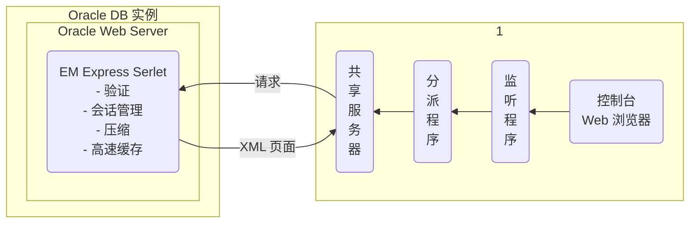

# EMCC 和 EMDE、Oracle SQL Developer

单个数据库

|||描述|
|:-|:-|:-|
|EMDC|Enterprise Manager Database Control|emca 命令创建，在 12c 中被 EMDE 取代|
|EMDE|Enterprise Manager Database Express|只需要配置一个端口即可使用，pdb 和 cdb 都可以配置 EMDE|

多台数据库服务器

|||描述|
|:-|:-|:-|
|EMGC|Enterprise Manager Grid Control|可以监控堕胎数据库服务器。用于 12c 之前|
|EMCC|Enterprise Manager Cloud Control|可以监控堕胎数据库服务器。EMCC 比 EMGC 功能更加强大，从 Oracle 12c 开始使用|

## EMCC

OCM 中详见

## EMDE

EMDC 不在支持了

### 体系结构

官方文档
>https://docs.oracle.com/en/database/oracle/oracle-database/12.2/admin/toc.htm  
>https://docs.oracle.com/en/database/oracle/oracle-database/12.2/admqs/getting-started-with-database-administration.html#GUID-BA75AD46-D22E-4914-A31E-C395CD6A2BBA



Enterprise Manager(EM) Database Express 是一个**轻量级管理工具**。占用空间很少，只有 50~100 MB。
- 数据库仅运行 SQL 调用，而在浏览器中执行 UI 呈现
- EM Express UI 使用基于 Web 的控制台与 XML DB 中提供的内置 Web 服务器进行通信
- 处理来自控制台的请求时，是 EM Express servlet 在处理这些请求，包括验证、会话管理、压缩和高速缓存
- 该 servlet 处理报告的请求并返回由 Web 浏览器呈现的 XML 页面。通常每个页面只有一个请求，以减少与数据库之间的往返次数。

### 配置

为每个数据库实例配置 HTTP 或 HTTPS 监听程序端口

验证 DISPATCHERS 参数
```
dispatchers=(PROTOCOL=TCP)(SERVICE=sampleXDB)
```
```sql
SQL> show parameter dispatchers;
```

使用 `DBMS_XDB_CONFIG.setHTTPsPort` 过程
```sql
SQL> EXEC DBMS_XDB_CONFIG.setHTTPsPort(5501);
SQL> EXEC DBMS_XDB_CONFIG.setHTTPPort(5500);
```

通过以下 URL 连接到 EM Database Express 控制台
```
https://hostname:5501/em
http://hostname:5501/em
```

- 对每个实例使用一个不同的端口
- 浏览器需要 Flash 插件

EM Database Express 可在 Database Configuration Assistant（DBCA）中通过一次单击来进行配置。

EM Database Express 要求安装 XMLDB 组件。所有 Oracle 12.1.0 版数据库都将安装 XMLDB。

要在数据库中激活 EM Database Express，请验证 DISPATCHERS 初始化参数是否已至少为使用 TCP 协议的 XMLDB 服务配置了一个分派程序。使用 EM XDB_CONFIG.setHTTPsPort（使用 SSL 进行保护）或 DBMS_XDB_CONFIG.setHTTPPort 过程配置在服务器上使用的端口。

如果在同一个计算机上有多个要监视的数据库实例，则每个实例需要使用不同的端口。

查看每个数据库实例的端口
```sql
SQL> SELECT DBMS_XDB_CONFIG.getHTTPsPort FROM dual;
SQL> SELECT DBMS_XDB_CONFIG.getHTTPPort FROM dual;
```

设置容器 `CDB$ROOT` 的端口
```sql
SQL> alter session set container=CDB$ROOT;
SQL> exec dbms_xdb_config.sethttpsport(5501);
```

设置 PDB 的端口
```sql
SQL> alter session set container=PDB1;
SQL> exec dbms_xdb_config.sethttpsport(5502);
```

关闭 EMDE
```sql
SQL> dbms_xdb_config.sethttpsport(0);
SQL> dbms_xdb_config.sethttpport(0);
```

查看设置的端口是否在监听中生效
```
# su - oracle
$ lsnrctl status | grep 55
```

### EMDE 主页

EM Database Express 只有在数据库打开时才可用。
- 不能用来启动数据库
- 需要数据库更改状态的其他操作（如启用或禁用 ARCHIVELOG 模式）不可用

## Oracle SQL Developer

Oracle SQL Developer 是一种工具，可用于以图形方式独立浏览和开发数据库方案对象，并可执行数据库管理任务。