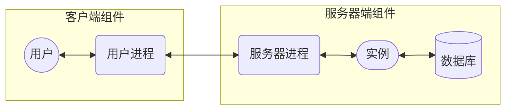

# 使用 Oracle 设计关系数据库

Oracle 服务器技术产品集不仅仅是一个数据库，还包括 Oracle WebLogic Server 和 Oracle Enterprise Manager。将它们组合在一起，就是构成 Oracle Cloud 的服务器技术。

结构化查询语言（Structured Query Language，SQL，读作“sequel”）是管理关系数据库中存储的数据的国际标准。Oracle Database 12c 提供一种 SQL 实现方式，它通常符合当前标准，即 Core SQL:2011。

两种工具用于联系：SQL*Plus 和 SQL Developer

两组示例数据：HR 和 OE 模式

## 定位服务器技术

- Oracle Database
- Oracle WebLogic Server
- Oracle Enterprise Manager
- 各种应用程序开发工具和语言

### Oracle 服务器的体系结构

数据库和实例
- Oracle 数据库就是磁盘上的一组文件。可以通过 Oracle 实例访问数据库。
- 实例就是一组进程个内存结构。数据库用户依据实例建立会话，之后由实例来管理对数据库的所有访问。

双层模型
- Oracle 服务器实现的处理模式是客户-服务器处理模型，通常称为双层（two-tier）模型。
- 客户层生成 SQL 命令，服务器层执行它们。
- 用户进程和服务器进程之间使用的网络通信协议是 Oracle 的专有协议 —— Oracle Net。

组成
- 客户层由两个组件组成：用户和用户进程
- 服务器层包含三个组件：执行 SQL 的服务器进程、实例和数据库本身

每个用户都与用户进程交互；每个用户进程都与服务器进程交互，通常要跨局域网；服务器进程与实例交互；实例与数据库交互。

会话
- 会话是与服务器进程进行通信的用户进程。
- 通常每个用户有一个用户进程，每个用户进程有一个服务器进程。

登录和退出周期
- 组成会话的用户进程和服务器进程由用户根据需求来启动，当不需要时就终止，这就是登录和退出周期。

数据库的启动和关闭周期
- 实例的进程和内存结构由数据库管理员启动，直到管理员有意终止它们为止。



用户进程
- 用户进程可以时能够连接 Oracle 服务器进程的任何客户端软件。
  - SQL*Plus 和 SQL Deveploer，它们是 Oracle 提供的简单进程，用来依据 Oracle 服务器建立会话，并发布即席（ad hoc）SQL。
  - Quest Software 的 TOAD（Tool for Application Developers）

### Oracle WebLogic Server

Oracle WebLogic Server 是用于开发、部署和管理 Web 应用程序的平台。与 Java EE 兼容。

### Oracle Enterprise Manager

三种形式
- Database Express
- Fusion Middleware Control
- Cloud Control

Oracle Enterprise Manager Database Express 是一种用来管理一个数据库的图形工具，这个数据库可以是 RAC 数据库。它由在数据库服务器上运行的 Java 进程组成。进行实时管理和性能监控，运行定期作业。

管理员 -> 浏览器 -> Database Express -> 数据库

Oracle Enterprise Manager Fusion Middleware Control 是一种用来管理 Fusion Middleware 部署的图形工具。

Oracle Enterprise Manager Cloud Control 全局化管理环境。管理仓库以及一个或多个管理服务器管理整个：所有数据库和应用服务器。

### 云计算

服务虚拟化（service virtualization）

请求服务和提供服务之间都有一个抽象层。

### 开发工具和语言

语言
- SQL
- PL/SQL，是 Oracle 专有的第三代语言（3GL）
- Java

工具
- Oracle Application Express
- JDevelper
- ADF

  构造发送给数据库服务器执行的 SQL 语句

在 Oracle 环境中工作的所有开发人员和管理员都必须掌握 PL/SQL。

## 理解关系结构

### 案例

1. Car Dealership 案例
2. Geological Cores 案例
3. Order Entry 案例
4. Human Resources 案例
   
### 数据建模

逻辑建模基于将对象概念化为实体（entity）和将这些对象彼此间的 交互概念化为关系（relationship）。

符号
- crow's foot
- Relational Schema 符号
- UML

### 实体和关系

逻辑模型 -> 关系模型
- 实体的一组实例建模为一个表
- 属性被转换为表的列
- 实体的每个实例作为数据元组（tuple）或数据行

实体之间的关系
- 1:N
- N:1
- 1:1
- N:N

范式
- 数据库的规范化是指使用多个实体及实体间的关系来对数据进行建模，这可能会减少或完全消除数据冗余。

1. 第一范式（1NF）：消除不必要重复的数据组。原子性，每个属性不可再分。
2. 第二范式（2NF）：从不依赖于主键的实体（1NF）中删除属性。符合第一范式（1NF），属性必须完全依赖于主键，没有部分依赖。不依赖或部分依赖主键的属性应该分离出来形成一个新的实体。
3. 第三范式（3NF）：从 2NF 实体中删除所有相互依赖的属性。符合第二范式（2NF），没有传递依赖。非主属性之间不存在依赖关系。

概念
1. 主键：属性用来唯一的标识一个数据元组或数据行
2. 关系：一对多和多对一常用来建模关系实体；一对一和多对多关系不是很常见，在关系模型中使用这两种关系有时会导致一些缺陷。
3. 参照完整性和外键：一个实体中的外键基于另外一个相关实体的唯一键，但这些唯一键并非必须是主键，它们只是必须唯一即可。

### 行和表

关系范例奖数据建模为二维表。表由许多行组成，行由一组列组成。在列级别，每列必须是一种数据类型。

## SQL 语言概述

SQL 由国际组织定义、开发和控制。SQL 语言本身非常简单，仅包含 16 个命令，但实际上 SQL 编码非常复杂。

### SQL 标准

SQL 首先由 IBM 研究小组于 20 世纪 70 年代开发。SQL 现在是国际标准。由 ISO 和 ANSI 管理。

### SQL 命令

数据操作语言（Data Manipulation Language，DML）命令
- SELECT
- INSERT
- UPDATE
- DELETE
- MERGE

数据定义语言（Data Definition Language，DDL）命令
- CREATE
- ALTER
- DROP
- RENAME
- TRUNCATE
- COMMENT

数据控制语言（Data Control Language，DCL）命令
- GRANT
- REVOKE

事务控制语言（Transaction Control Language，TCL）命令
- COMMIT
- ROLLBACK
- SAVEPOINT

### 面向集合的语言

大多数 3GL 都是过程语言。每次一行操作数据。对于开发和执行而言，过程语言在管理数据方面通常比面向集合的语言效率要低。

SQL 不能提供完整的解决方案，它纯粹是数据访问语言。大多数应用程序都需要程序结构，例如流程控制。对于应用程序开发而言，人们需要能够调用 SQL 的过程语言，因此 SQL 需要于过程语言一起使用。

## 使用客户工具

SQL*Plus 和 SQL Developer

### SQL*Plus

SQL\*Plus 是用于连接数据库和巴福即席 SQL 命令的客户-服务器工具。它也可以用来创建 PL/SQL 代码，并且有助于格式化结果。SQL\*Plus 是用 C 语言编写的用户进程。它建立与实例的会话，并通过 Oracle Net 协议连接数据库。客户和服务器的平台可以不同。

1. Linux 上的 SQL*Plus
   
   在 Linux 上安装的 SQL\*Plus 的可执行文件是 sqlplus。该文件的位置通常如下

   `/u01/app/oracle/product/12.1.0/db_1/bin/sqlplus`

   需要设置的环境变量
   - ORACLE_HOME
   - PATH
   - LD_LIBRARY_PATH

   ORACLE_HOME 变量指向 Oracle Home，Oracle Home 是 Oracle 软件安装程序，包含可执行代码和默写配置文件的文件集和目录集。  
   PATH 必须包含 Oracle Home 中的 bin 目录。  
   LD_LIBRARY_PATH 应该也包含 Oracle Home 中的 lib 目录，但实际上可以不设置它。

   登录

       $ sqlplus system/admin123@coda

1. Windows 上的 SQL*Plus

   通常的位置

   `D:\app\oracle\product\12.1.0\dbhome_1\BIN\sqlplus.exe`

   登录

       Enter user-name:  system/admin123@coda
   
   不显示登录提示

       sqlplus /nolog

   环境变量

   `HKEY_LOCAL_MACHINE`  
   `SOFTWARE`  
   `ORACLE`  
   `KEY_OraDb12c_home1`

   变量 ORACLE_HOME 和 ORACLE_HOME_NAME 的值。它们与可执行文件 sqlplus.exe 的位置以及到达启动它的快捷方式的 Start 菜单导航路径相关。

1. 创建和测试数据库连接

       sqlplus scott/tiger@orcl
       sqlplus scott/tiger@ocp12c.oracle.com:1511/orcl.oracle.com

   第一个示例使用别名 orcl 来标识数据库。它必须被解析为完整连接细节。  
   第二个示例提供所以连接细节。包括运行数据库实例的计算机的主机名；可以连接 Oracle Net 数据库侦听器的 TCP 端口；用户希望数据库侦听器连接的数据库服务。

1. 连接错误

   错误的连接标识符

   `ORA-12154:  TNS:could not resolve the connect identifier specified`

   侦听器没有运行、地址解析不正确

   `ORA-12541:  TNS:no listener`

   实例没有启动

   `ORA-12514:  TNS:listener does not currently know of service requested in connect descriptor`

   用户名密码错误

   `ORA-01017:  invalid username/password; logon denied`

### SQL Developer

SQL Developer 是连接 Oracle 数据库和发布即席 SQL 命令的工具。它也可以管理 PL/SQL 对象。它是一个图形工具。用 Java 编写的，需要 Java 运行时环境来运行。

1. 安装和启动 SQL Developer

   检查 JDK 的版本是否正确

       java -version

   解压缩 SQL Developer 之后，将当前目录更改为解压缩 SQL Developer 的目录，然后启动它
   - 在 Windows 上，可执行文件是 sqldeveloper.exe
   - 在 Linux 上，是 sqldeveloper.sh shell 脚本。需要检查 DISPLAY 环境变量是否已经设置为合适的值（例如：127.0.0.1:0.0）

1. SQL Developer 用户界面

   略

1. 创建数据库连接

   Role 下拉框提供作为 sysdba 连接的选项

   Connection Type 单选按钮
   - Basic：数据库服务器名称、侦听器端口、实例（SID）或者服务
   - TNS：使用本地 tnsnames.ora 文件选择数据库的别名
   - LDAP：LDAP Server 细节
   - Advanced：完整的 JDBC 连接字符串
   - Local/Bequeath：

## 创建演示模式

HR 模式和 OE 模式

更早的演示模式是 SCOTT（密码 tiger）。创建脚本 utlsampl.sql

### 用户和模式

定义
- 数据库用户（user）是能够登录数据库的人
- 数据库模式（schema）是在数据库中一个用户拥有的全部对象

这两个术语通常可以交换使用，因为用户和模式之间是一对一的关系。CREATE USER 创建用户，创建的模式是空的。CREATE SCHEMA 不创建模式，它只是一种利用模式创建对象的快速方法。

模式用于存储对象，这些对象可能是数据对象或程序化对象。在默认情况下，用户能够访问自己模式中的对象，不能访问其他对象。一种模式可用来保存数据，允许使用模式中的对象的其他用户访问这些数据。一些用户拥有数据保存模式可能从未登录；另一些用户的模式没有对象，只有权限访问其他模式中的对象。

数据对象不能独立于模式而存在。必须有所有者，所有者就是用户。模式对象的唯一标识符是用户名加对象名称。同一个模式中不能存在同名称的对象，相同名称的对象可以存在不同的模式中。同义词是一种结构，通过这个结构可以使用其他用户访问对象，而不必将对象的模式名称作为前缀。

### HR 和 OE 模式

HR 模式是模仿简单人力资源应用程序的样本数据

OE 模式是模仿订单录入应用程序

### 创建演示模式

Database Configuration Assistant 在创建数据库时提供的一个选项

解锁模式，使用具有 DBA 特权的用户执行

```
SQL> alter user hr account unlock identified by hr;
SQL> alter user oe account unlock identified by oe;
```

创建数据库时没有创建模式，那么通过运行安装在数据库 Oracle Home 中的脚本就可以创建它们。

```
SQL> @?/demo/schema/human_resources/hr_main.sql
SQL> @?/demo/schema/order_entry/oe_main.sql
```

“?”字符是一个变量，SQL*Plus 会将该变量的内容扩展到 Oracle Home 目录所在的路径。

Windows 上创建模式的过程是类似的，除了路径分隔符，Windows 使用反斜杠。

注意，运行这些创建模式的脚本会删除已经存在的模式。